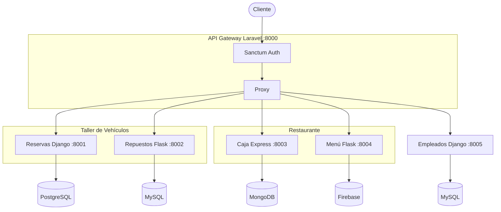

# Sistema ManiEje — Arquitectura de Microservicios

## Descripción
Sistema de gestión empresarial para un taller de vehículos y restaurante de comidas rápidas llamado ManiEje, construido con arquitectura de microservicios. Desarrollado como proyecto académico para la Universidad Nacional de Colombia —  Manizales.

## Arquitectura
```
Cliente (Thunder Client / Frontend)
              │
              ▼
┌─────────────────────────────────┐
│     API Gateway — Laravel :8000 │
│  Sanctum · Login · Logout       │
│  Pregunta secreta · Proxy       │
└──────┬──────┬──────┬──────┬─────┘
       │      │      │      │      │
       ▼      ▼      ▼      ▼      ▼
   :8001   :8002  :8003  :8004  :8005
 Reservas Repuest  Caja   Menú  Empleados
  Django   Flask  Express Flask  Django
 PostgreSQL MySQL MongoDB Firebase MySQL
```

## Tecnologías

| Microservicio | Framework | Base de datos | Puerto |
|---|---|---|---|
| API Gateway | Laravel 12 + Sanctum | SQLite | 8000 |
| ms-reservas | Django 5 + DRF | PostgreSQL | 8001 |
| ms-repuestos | Flask + SQLAlchemy | MySQL | 8002 |
| ms-caja | Express + Mongoose | MongoDB | 8003 |
| ms-menu | Flask + Firebase Admin | Firebase Realtime DB | 8004 |
| ms-empleados | Django 5 + DRF | MySQL | 8005 |

##  Archivos requeridos (enviados por separado)
| Archivo | Carpeta destino |
|---|---|
| `firebase-key.json` | `ms-menu/` |
| `.env` | `api-gateway/` |
| `.env` | `ms-reservas/` |
| `.env` | `ms-repuestos/` |
| `.env` | `ms-caja/` |
| `.env` | `ms-menu/` |
| `.env` | `ms-empleados/` |

## Instalación y ejecución

### Requisitos previos
- PHP 8.3+ y Composer
- Python 3.11+
- Node.js 18+
- MySQL corriendo en localhost:3306
- PostgreSQL corriendo en localhost:5432
- MongoDB corriendo en localhost:27017

### 1. API Gateway — Laravel :8000
```bash
cd api-gateway
composer install
php artisan key:generate
php artisan migrate
php artisan serve
```

### 2. Microservicio Reservas — Django :8001
```bash
cd ms-reservas
python -m venv venv
source venv/Scripts/activate  # Windows Git Bash
pip install -r requirements.txt
python manage.py migrate
python manage.py runserver 8001
```

### 3. Microservicio Repuestos — Flask :8002
```bash
cd ms-repuestos
python -m venv venv
source venv/Scripts/activate
pip install -r requirements.txt
flask db upgrade
python app.py
```

### 4. Microservicio Caja — Express :8003
```bash
cd ms-caja
npm install
node index.js
```

### 5. Microservicio Menú — Flask :8004
```bash
cd ms-menu
python -m venv venv
source venv/Scripts/activate
pip install -r requirements.txt
python app.py
```

### 6. Microservicio Empleados — Django :8005
```bash
cd ms-empleados
python -m venv venv
source venv/Scripts/activate
pip install -r requirements.txt
python manage.py migrate
python manage.py runserver 8005
```

## Endpoints

### API Gateway — Autenticación
| Método | Endpoint | Descripción | Auth |
|---|---|---|---|
| POST | /api/auth/register | Registrar usuario | No |
| POST | /api/auth/login | Iniciar sesión | No |
| POST | /api/auth/logout | Cerrar sesión | Si |
| GET | /api/auth/me | Usuario actual | Si |
| POST | /api/auth/obtener-pregunta | Obtener pregunta secreta | No |
| POST | /api/auth/reset-password | Resetear contraseña | No |

### Reservas :8001
| Método | Endpoint | Descripción |
|---|---|---|
| GET | /api/reservas/ | Listar reservas |
| POST | /api/reservas/ | Crear reserva |
| GET | /api/reservas/:id/ | Obtener reserva |
| PUT | /api/reservas/:id/ | Actualizar reserva |
| DELETE | /api/reservas/:id/ | Eliminar reserva |
| GET | /api/reservas/estado/:estado/ | Filtrar por estado |
| PUT | /api/reservas/:id/estado/ | Cambiar estado |

### Repuestos :8002
| Método | Endpoint | Descripción |
|---|---|---|
| GET | /api/repuestos | Listar repuestos |
| POST | /api/repuestos | Crear repuesto |
| GET | /api/repuestos/:id | Obtener repuesto |
| PUT | /api/repuestos/:id | Actualizar repuesto |
| DELETE | /api/repuestos/:id | Eliminar repuesto |
| PUT | /api/repuestos/:id/stock | Actualizar stock |
| GET | /api/repuestos/stock-bajo | Repuestos bajo mínimo |

### Caja :8003
| Método | Endpoint | Descripción |
|---|---|---|
| GET | /api/caja | Listar transacciones |
| POST | /api/caja | Registrar transacción |
| GET | /api/caja/:id | Obtener transacción |
| GET | /api/caja/resumen/:fecha | Resumen del día |
| POST | /api/caja/cierre | Cierre de caja |
| DELETE | /api/caja/:id | Eliminar transacción |

### Menú :8004
| Método | Endpoint | Descripción |
|---|---|---|
| GET | /api/menu | Listar menú |
| POST | /api/menu | Crear item |
| GET | /api/menu/:id | Obtener item |
| PUT | /api/menu/:id | Actualizar item |
| DELETE | /api/menu/:id | Eliminar item |
| PUT | /api/menu/:id/disponibilidad | Toggle disponibilidad |
| GET | /api/menu/categoria/:cat | Filtrar por categoría |

### Empleados :8005
| Método | Endpoint | Descripción |
|---|---|---|
| GET | /api/empleados/ | Listar empleados |
| POST | /api/empleados/ | Crear empleado |
| GET | /api/empleados/:id/ | Obtener empleado |
| PUT | /api/empleados/:id/ | Actualizar empleado |
| DELETE | /api/empleados/:id/ | Desactivar empleado |
| GET | /api/empleados/area/:area/ | Filtrar por área |
| GET | /api/empleados/nomina/ | Ver nómina total |

## Pruebas de rendimiento — Locust
```bash
pip install locust
locust -f locustfile.py --host=http://localhost:8000
# Abrir http://localhost:8089
```

### Resultados

| Prueba | Usuarios | RPS | Fallos | Tiempo promedio |
|---|---|---|---|---|
| Carga | 10 | 2.5 | 0% | 2500ms |
| Capacidad | 50 | 2.5 | 0% | 17468ms |
| Estrés | 100 | 2.6 | 0% | 24905ms |

### Análisis
El sistema mantiene 0% de fallos en las 3 pruebas, demostrando estabilidad. El tiempo de respuesta escala con la carga debido a que los servicios corren en modo desarrollo (single-thread). En producción con Docker y servidores WSGI como Gunicorn los tiempos mejorarían significativamente.

## Diagrama del sistema
